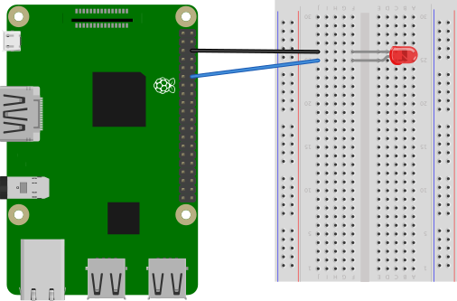
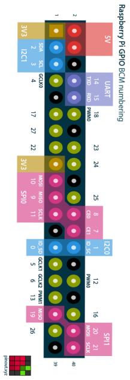

# Controlling an LED

Within this tutorial you are going to learn how to create a simple circuit and using the Raspberry Pi and Python to control an LED.

## What You Will Need

The equipment you need is:

* 1 x LED
* 2 x Male to Female jumper wires
* 1 x breadboard
* A Raspberry Pi

## Creating The Circuit

Let's create the electronic circuit that we are going to control using Python and a Raspberry Pi.

The Circuit will look like this:

 

**NOTE:** The LED has one short leg known as the cathode (Negative = -) and one long leg known as the anode (positive = +)

The Anode is connected to pin 18 on the Raspberry Pi
The Cathode is connected to ground on the Raspberry Pi

Once the LED is wired to the Raspberry Pi this completes our electronic circuit.

We can now code our LED to do something.

## Coding The LED

### Turning The LED On

1. Open up your favourite Python Editor. I will be using Mu through this tutorial as it is a beginner friendly editor. If you do not have Mu installed you can find out how to install it here.

2. Type the following code:

   ```python
   from gpiozero import LED

   led = LED(18)

   led.on ()
   ```

   This will import the LED module from the gpiozero library. Set the LED at pin 18 making it programmable and then turn the LED on.

3. Click on Run

4. If you have typed the code above correctly you should now see the LED turn on

### Turning an LED Off

Change the line ```led.on ()``` to ```led.off ()```

### Making an LED Blink

Under the line ```from gpiozero import LED`` Type ``` from ```time import sleep```

Delete the ```led.off ()``` and type the following:
``` Python
while True:
    led.on ()
    sleep (1)
    led.off ()
    sleep (1)
```

You now know how to control an LED.

Why don't you adjust the number after the sleep block and see what happens.